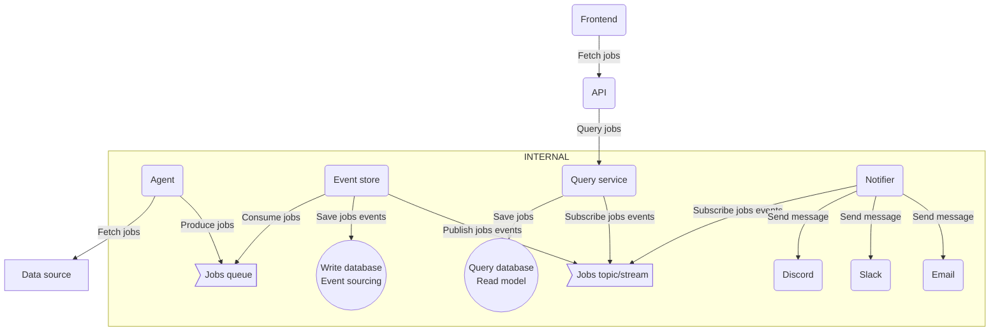

# Architecture

```mermaid
  graph TB
    Agent(Agent) -->|Fetch jobs| Data-source[Data source]

    subgraph INTERNAL
        Agent(Agent) -->|Produce jobs| Jobs-queue>Jobs queue]
          
        Event-store(Event store) -->|Consume jobs| Jobs-queue>Jobs queue]
        Event-store(Event store) -->|Save jobs events| Event-store-database((Write database \n Event sourcing))
        Event-store(Event store) -->|Publish jobs events| Jobs-topic>Jobs topic/stream]
          
        Query-service(Query service) -->|Save jobs| Query-service-database((Query database \n Read model))
        Query-service(Query service) -->|Subscribe jobs events| Jobs-topic>Jobs topic/stream]

        Notifier(Notifier) -->|Subscribe jobs events| Jobs-topic>Jobs topic/stream]
        Notifier(Notifier) -->|Send message| Discord(Discord)
        Notifier(Notifier) -->|Send message| Slack(Slack)
        Notifier(Notifier) -->|Send message| Email(Email)
    end

        API(API) -->|Query jobs| Query-service(Query service)

        Frontend(Frontend) -->|Fetch jobs| API(API)
```