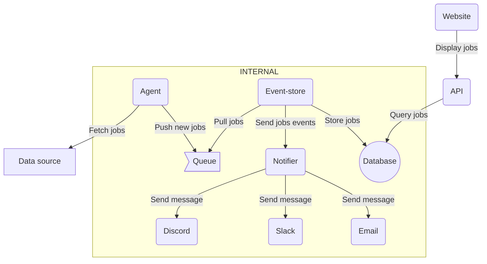

# Architecture

```mermaid
  graph TB
      A(Agent) -->|Fetch jobs| B[Data source]
      subgraph INTERNAL
          A(Agent) -->|Push new jobs| C>Queue]
          D(Event-store) -->|Pull jobs| C>Queue]
          D(Event-store) -->|Send jobs events| F(Notification Service)
          D(Event-store) -->|Store jobs| E((Database))
          F(Notifier) -->|Send message| G(Discord)
          F(Notifier) -->|Send message| H(Slack)
          F(Notifier) -->|Send message| I(Email)
      end
          J(API) -->|Query jobs| E((Database))
          K(Website) -->|Display jobs| J(API)
```